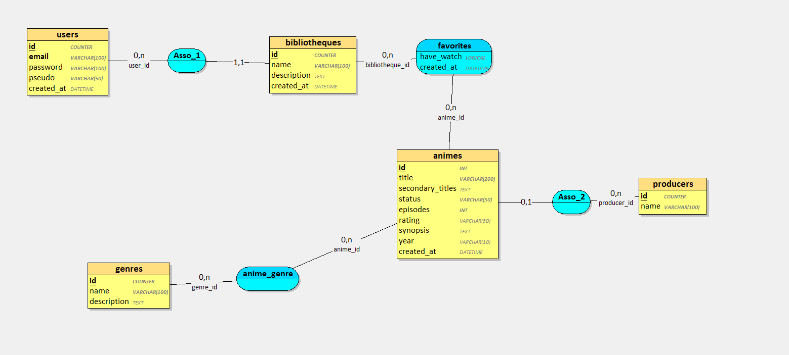

# 📚 Kioku – Bibliothèque d’animes

**Kioku** est une application mobile Flutter qui permet de rechercher, filtrer et organiser ses animes favoris à partir de l’API Jikan. Les utilisateurs peuvent explorer les titres populaires, consulter des fiches détaillées, et constituer leur propre bibliothèque via une base de données Supabase.

---

## 🧩 Présentation générale

- **Nom du projet** : Kioku
- **Technologies** : Flutter (Dart), Supabase (PostgreSQL), API Jikan
- **Base de données** : Supabase (hébergé, typé)
- **Type de projet** : Application mobile (solo)
- **Backend** : Supabase + API publique Jikan (MyAnimeList)
- **Interface** : Flutter avec navigation bottom bar
- **Objectif** : Gérer sa collection d’animes favoris simplement

---

## ✨ Fonctionnalités principales

| Fonction                          | Description |
|----------------------------------|-------------|
| 🔍 Recherche d’animes            | Par nom, avec filtres (en cours, à venir, top) |
| ⭐ Gestion des favoris           | Ajout/Suppression en base Supabase |
| 📄 Fiche anime détaillée         | Titre, synopsis, nombre d’épisodes, genres |
| ⚙️ Mode sombre / clair           | Toggle dans les paramètres |
| 🧾 Persistance                   | Liste conservée en base entre les sessions |
| 🔄 Rafraîchissement auto        | La bibliothèque se recharge automatiquement à chaque retour |
| 🧠 Optimisation navigation       | State conservé via IndexedStack / clés dynamiques |

---

## ⚙️ Architecture technique

- **Flutter** : UI mobile, navigation, state
- **Supabase** : Backend DB (PostgreSQL)
  - Table `favoris`
  - Champs : `mal_id`, `title`, `image_url`, `episodes`, `genres`, `synopsis`
- **Jikan API** : Source des animes (recherche + détails)
- **Stockage favoris** : uniquement en ligne (pas de login)

---

## 📦 Structure des fichiers

```
/lib
 ├── main.dart
 ├── app.dart
 ├── models/
 │    └── anime.dart
 ├── services/
 │    ├── jikan_api.dart
 │    └── supabase_service.dart
 ├── pages/
 │    ├── search_page.dart
 │    ├── library_page.dart
 │    ├── settings_page.dart
 │    └── anime_detail_page.dart
 ├── components/
 │    ├── anime_card.dart
 │    └── bottom_nav.dart
```

---

## 🧪 Tests prévus (non encore implémentés)

- Tests unitaires sur `Anime.fromJson()`
- Mocks pour `SupabaseService` (ajout/suppression)
- Tests UI potentiels avec `flutter_test`

---

## 🔁 Organisation par sprints

| Sprint       | Objectifs clés |
|--------------|----------------|
| Sprint 0     | Maquettes + config projet Flutter |
| Sprint 1     | Intégration API Jikan + affichage des résultats |
| Sprint 2     | Connexion à Supabase + gestion favoris |
| Sprint 3     | Fiche détail + navigation complète |
| Sprint final | Nettoyage + rafraîchissement + readme + livrables |

---

## 📋 Livrables

- ✅ Code source Flutter (GitHub)
- ✅ Base Supabase fonctionnelle
- ✅ README complet
- ✅ Présentation orale avec démonstration
- ✅ Diagrammes UML (à faire si demandé)
- 🟡 Tests (préparés, à implémenter)

---

## ✅ Conformité au cahier des charges (Projet TPRE300)

| Critère                            | Couvert |
|-----------------------------------|---------|
| Authentification                  | Non (simulation possible) |
| CRUD complet                      | ✅ (ajout / suppression favoris) |
| Base de données relationnelle     | ✅ Supabase PostgreSQL |
| Interaction via API               | ✅ Jikan |
| Fonctionnalités avancées          | ✅ (filtres, détail, favoris, responsive) |
| Suivi, historique, persistance    | ✅ via Supabase |
| Tests et documentation            | 🟡 en cours |

---

## 💬 Remarques finales

Le projet Kioku est un bon exemple de solution Flutter connectée à une base cloud. Il est conforme aux attendus d’un projet de validation avec base distante, logique de navigation claire, et gestion utilisateur simple via favoris persistants.

---

## 🧮 Modèle Conceptuel de Données (MCD)

Le schéma suivant représente le modèle conceptuel de données (MCD) de l'application **Kioku** :



### 🔗 Explication du MCD

- **users** : Représente les utilisateurs (non utilisé actuellement mais prévu pour une future extension avec comptes personnels).
  - Champs : `email`, `password`, `pseudo`, `created_at`

- **bibliotheques** : Représente une collection d’animes personnalisée, liée à un utilisateur.

- **favorites** : Table associative entre les bibliothèques et les animes, permettant d’indiquer si l’utilisateur a regardé l’anime (`have_watch`).

- **animes** : Stocke les informations principales d’un anime : `title`, `synopsis`, `episodes`, `rating`, `status`, etc.

- **genres** : Liste les genres possibles d’un anime.

- **anime_genre** : Table associative entre les animes et les genres (relation plusieurs-à-plusieurs).

- **producers** : Liste des producteurs d’animes.

- **asso_1**, **asso_2** : Associations de type plusieurs-à-plusieurs utilisées pour relier `users` ↔ `bibliotheques` et `animes` ↔ `producers`.

> 🎯 À noter : Pour notre version actuelle de Kioku, seule une version simplifiée du modèle est implémentée, sans utilisateurs ni producteurs.

